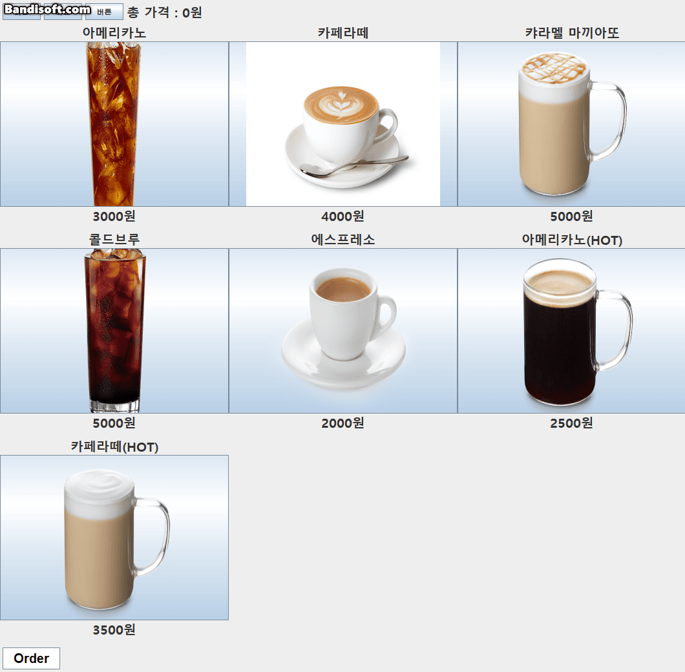

# JavaKiosk

Use Java,Mysql kisok project

# Preview

---
<h2 style="color:#dcffe4">
Order
</h2>

<h3>
Click the menu icon you can add the items and show bottom panel.

</h3>

<h2 style="color:#dcffe4">
Cancle
</h2>

<h3>
Click the menu icon on bottom panel it remove on the panel
</h3>